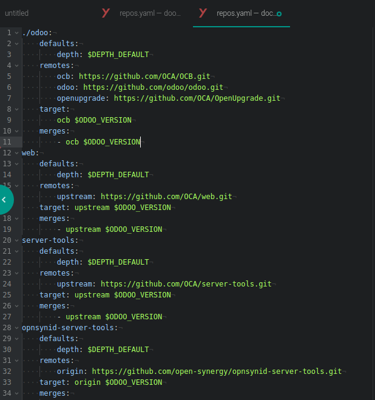
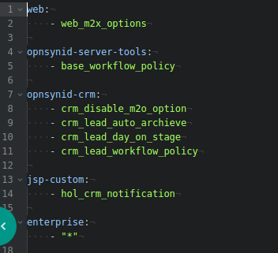

# Mendaftarkan Repositori Baru

### 1. Buka file <nama-folder-development>/odoo/custom/src/repos.yaml

### 2. Daftarkan repositori

Tambahkan kode berikut:

```yaml
<alias-repositori>:
    defaults:
        depth: $DEPTH_DEFAULT
    remotes:
        origin: <url-repositori>
    target: origin $ODOO_VERSION
    merges:
        - origin $ODOO_VERSION
```

Keterangan (harus disesuaikan):

* *alias-repositori*: alias yang akan dipergunakan oleh repositori
* *url-repositori*: URL repositori. Dapat berbentuk SSH atau https

Contoh penambahan repositori OCA server tools dengan https:

```yaml
oca-server-tools:
    defaults:
        depth: $DEPTH_DEFAULT
    remotes:
        upstream: https://github.com/OCA/server-tools.git
    target: upstream $ODOO_VERSION
    merges:
        - upstream $ODOO_VERSION
```

Berikut adalah contoh kode:




### 3. Buka file <nama-folder-development>/odoo/custom/src/repos.yaml

### 4. Tambahkan entri addons dari repo baru yang mau digunakan

Sintaks untuk menggunakan hanya sebagian modul dalam repo:

```bash
<alias-repositori>:
    - <module-yang-akan-digunakan-1>
    - <module-yang-akan-digunakan-2>
    - ...
    - <module-yang-akan-digunakan-n>
```

Sintaks untuk menggunakan semua modul dalam repositori

```bash
<alias-repositori>:
    - "*"
```

Contoh untuk menggunakan beberapa modul di repo OCA server tools:

```bash
oca-server-tools:
    - date_range
    - shell
```

Contoh untuk menggunakan semua modul di repo OCA server tools:

```bash
oca-server-tools:
    - "*"
```

Berikut adalah contoh kode:



### 5. Jalankan git-aggregator

Sintaks:

```bash
sudo docker-compose -f devel.yaml restart odoo
```

### 6. Restart Container Odoo

Sintaks:

```bash
sudo docker-compose -f devel.yaml restart odoo
```

### 7. Update module list di Odoo

Modul-modul yang ada di **addons.yaml** akan tampil di daftar module
