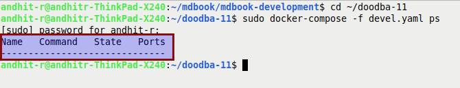

# Menjalankan Odoo Aplication Service

### 1. Buka Terminal

*(Abaikan jika terminal sudah dibuka)*

### 2. Masuk ke dalam folder <name-folder-development>

Sintaks:

```bash
cd <nama-folder-development>
```

*(Abaikan jika sudah berada di dalam <nama-folder-development>)*

### 3. Cek apakah docker service sudah berjalan

Sintaks:

```bash
sudo docker-compose -f devel.yaml ps
```

Berikut adalah hasil yang akan ditampilkan jika docker service tidak berjalan



### 4. Jalankan docker service

Sintaks:

```bash
sudo docker-compose -f devel.yaml up
```

### 5. Buka Browser

Gunakan Google Chrome, Google Chromium, atau Mozilla Firefox

### 6. Buka URL Odoo

```bash
localhost:<versi-major-odoo>069
```

Keterangan:

* *versi-major-odoo*: versi odoo yang sedang didevelop. Contoh: untuk versi 12.0 port yang akan digunakan adalah 12069
