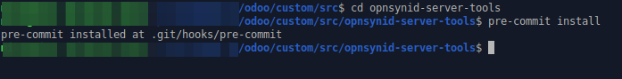

# INSTALASI

#### Instalasi pre-commit dengan menggunakan pip

````bash
pip install pre-commit
````
#### Instalasi pre-commit dengan menggunakan homebrew

````bash
brew install pre-commit
````
#### Instalasi pre-commit dengan menggunakan conda

````bash
conda install -c conda-forge pre-commit
````
# PENGGUNAAN

#### 1. Install git-hook scripts pada repository

````bash
cd <repository>
pre-commit install
````
Contoh:

#### 2. Pre-commit akan otomatis dieksekusi ketika melakukan commit, tetapi apabila sudah terlanjur di-commit, maka jalankan syntaks:
Cek semua files di repository:
````bash
cd <repository>
pre-commit run -a
````
Contoh:


Cek hanya folder tertentu di repository:
````bash
cd <repository>
git ls-files -- <folder> | xargs pre-commit run --files
````
Contoh:


Cek hanya file tertentu di repository:
````bash
cd <repository>
pre-commit run --files <file>
````
Contoh:

