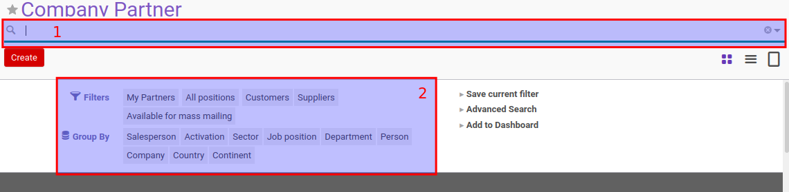

# Field-field Yang Dapat Dicari Pada Search View

Pada search view, terdapat 2 metode pencarian:

1. Menggunakan Search Bar
2. Menggunakan Filter Bar

### Field-field yang wajib dapat dicari pada Search Bar

1. name
2. code
3. type: many2one

### Field-field yang wajib dapat dicari pada Filter Bar:

1. state
2. type: many2one
3. type: date (day, week, month, year)

### CONTOH KODE SEARCH BAR

<code data-gist-id="652a38ebcdb82165842a59ba0084114c" data-gist-highlight-line="6-12" data-gist-line="1-12"></code>

### CONTOH KODE FILTER BAR

<code data-gist-id="652a38ebcdb82165842a59ba0084114c" data-gist-line="13-127"></code>
