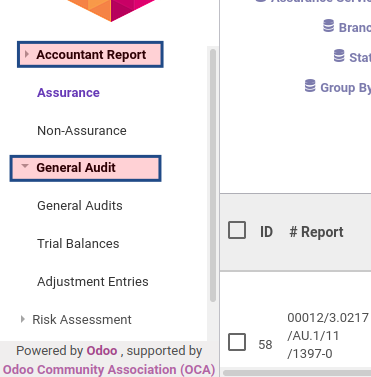
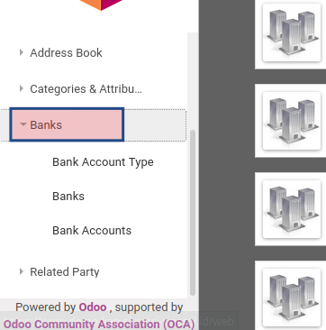
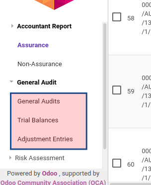
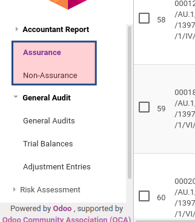
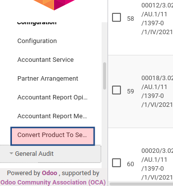

# Label Menu

### Menu tanpa action selalu dalam bentuk tunggal

**Contoh Benar**

**Contoh Salah**

### Menu dengan window action bukan wizard selalu dalam bentuk jamak

**Contoh Benar**

**Contoh Salah**

### Menu dengan window actiom wizard selalu dalam bentuk tunggal

**Contoh Benar**

