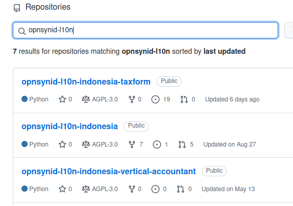

# Clone Remote Repository

> Note: Abaikan proses ini apabila remote repository sudah di-*clone*

#### 1. Buka github opensynergy [github.com/open-synergy](https://github.com/open-synergy) dan login.

#### 2. Pada Search Bar, cari repository yang hendak di-*clone*.



#### 3. Klik Tombol **Code**, pilih **HTTPS**, kemudian copy alamat repositorynya.


#### 4. Clone Repository

Pada terminal, jalankan sintaks berikut:

````bash
cd {nama-folder-odoo-8}/odoo/custom/src

git clone -b {odoo-version} {alamat-repo-pada-langkah-3}
````
