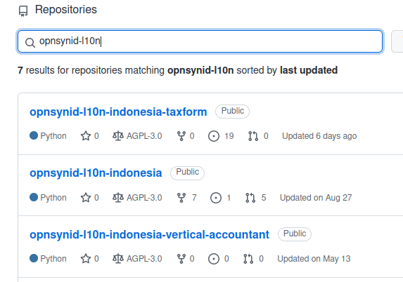
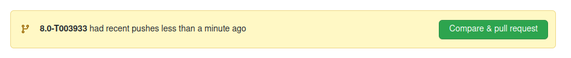
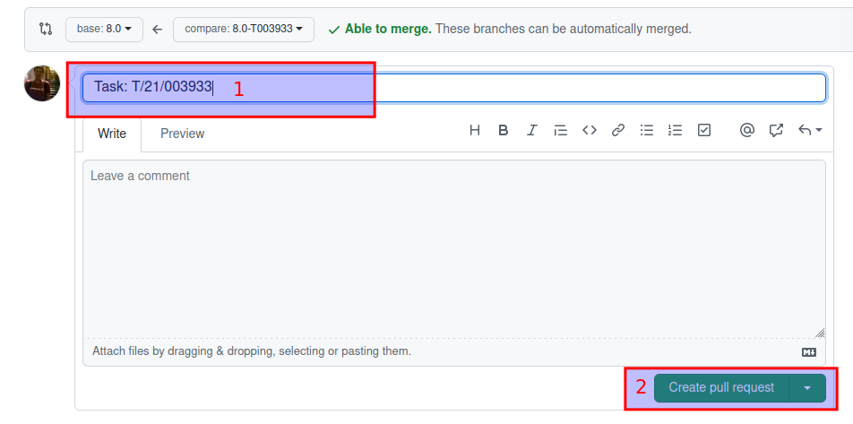

# Melakukan Pull Request

#### 1. Buka github opensynergy [github.com/open-synergy](https://github.com/open-synergy) dan login.

#### 2. Pada Search Bar, cari repository yang hendak dibuat Pull Requestnya.

#### 3. Klik tombol **Compare & pull request**

#### 4. Membuat Pull Request

* **1** - Isi deskripsi dengan nomor task
* **2** - Klik Tombol **Create pull request**
