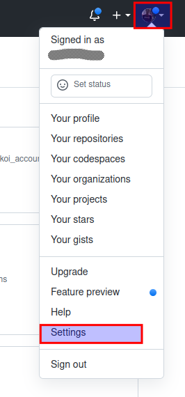
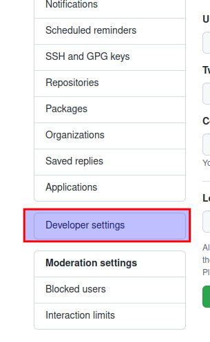
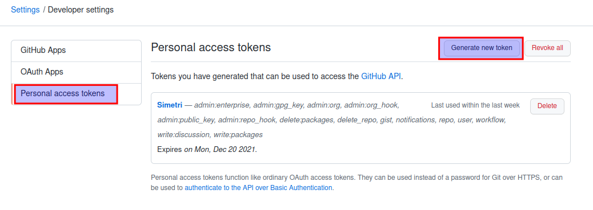
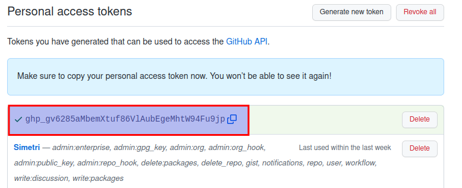

# Persiapan Awal

#### 1. Installasi git

Pada terminal, jalankan sintaks berikut:

````bash
$ sudo apt install git
````

#### 2. Set global user name dan email

Pada terminal, jalankan sintaks berikut:

````bash
$ git config --global user.name "{nama}"
$ git config --global user.email "{email}"
````

Cek apakah global user name dan email sudah terkonfigurasi

````bash
$ git config --list
````

#### 3. Membuat token github

1. Buka github [github.com](https://github.com) dan login.

2. Klik icon profile pada kanan atas, dan klik menu **Settings**.



3. Klik menu **Developer settings**.



4. Klik menu **Personal access tokens** dan klik tombol **Generate new token**.



5. Isi form kemudian klik tombol **Generate token**. Penjelasan pengisian form sebagai berikut:

* **Note** - Deskripsi penggunaan token
* **Expiration** - Masa aktif token. Silahkan isi sesuai kebutuhan
* **Select scopes** - Check semuanya

6. Copy token dan simpan di tempat yang aman



>> Note: Token akan berlaku sesuai dengan pengisian **Expiration**.
Apabila token expire, maka user wajib melakukan **Regenerate Token** untuk memperbarui token.
