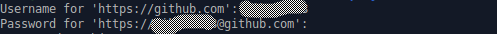

# Push Remote Repository

> Note: Langkah ini dilakukan ketika task sudah selesai dikerjakan

#### 1. Masuk ke direktori repository

Pada terminal, jalankan sintaks berikut:

````bash
cd {nama-folder-odoo-8}/odoo/custom/src/{nama-remote-repository}
````
> Note: Abaikan apabila sudah masuk ke dalam direktori repository

#### 2. Git Add

Pada terminal, jalankan sintaks berikut:

````bash
git add -A
````

#### 3. Install pre-commit

Pada terminal, jalankan sintaks berikut:

````bash
pre-commit install
````
> Note: Abaikan apabila pre-commit sudah terinstall

#### 4. Git Commit

Ketentuan standar commit:
- Pastikan 1 module = 1 commit
- Format Commit:
  > [nama_module/repo] version/pre-commit fix/unittest
  > * keterangan detail commit #1
  > * keterangan detail commit #2 <br/>
  > * ... <br/>
  > * ...
  > * keterangan detail commit #n

Pada terminal, jalankan sintaks berikut:

````bash
git commit -m "{ketentuan-standar-commit}"
````

Contoh:

````bash
git commit -m "[module_test_1] 8.0.1.0.0
Pembuatan Modul Baru"
````
````bash
git commit -m "[module_test_1] pre-commit fix"
````
````bash
git commit -m "[repo_test_1] 8.0
Initial Commit"
````

> Note: Langkah 4.1 diperlukan apabila pre-commit tidak jalan

#### 4.1 Uninstall dan install pre-commit

Pada terminal, jalankan sintaks berikut:

````bash
pre-commit uninstall
pre-commit install
````

#### 5. Git Push

Pada terminal, jalankan sintaks berikut:

````bash
git push origin {nama-branch}:{nama-branch}
````
> Note: Nama branch adalah nama branch yang sudah dibuat pada [Membuat Branch Baru](./membuat-branch-baru.md)

#### 6. Konfirmasi Git Push



* **Username** - Isi username dengan user github
* **Password** - Isi password dengan **Token Github** yang sudah dibuat pada [Persiapan Awal](./persiapan-awal.md)
