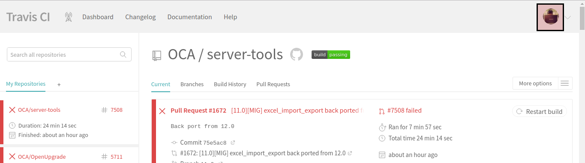
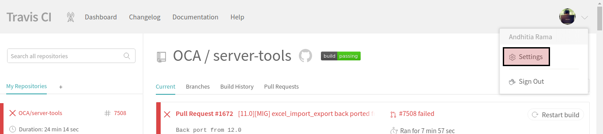
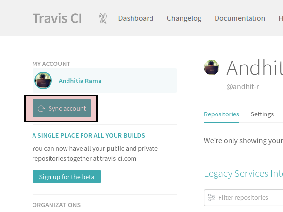
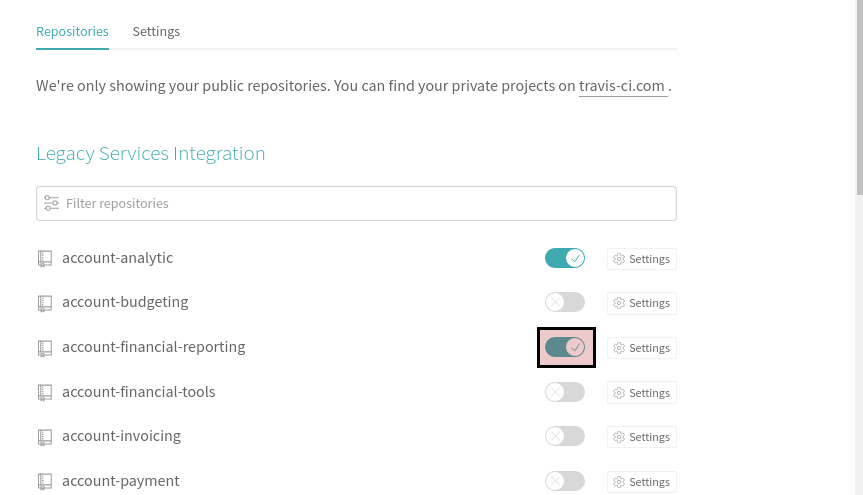

# Mendaftarkan Repository Github Ke Travis

#### 1. Buka [travis-ci.org](https://travis-ci.org) dan login dengan menggunakan Github.

Abaikan jika Anda sudah berada pada travis-ci.org

#### 2. Klik profile picture Anda pada bagian atas-kanan halaman

#### 3. Klik menu *Setting* yang muncul pada profile picture Anda

#### 4. Klik tombol *Sync account*

#### 5. Pindah ke halaman organisasi apabila Anda akan mendaftarkan repository milik organisasi. Abaikan langkah ini apabila Anda akan mendaftarkan repository milik pribadi.

Klik salah satu nama organisasi pada bagian **Organizations**

#### 6. Aktifkan Repository

Aktifkan toogle yang berada pada bagian kanan nama repository yang Anda inginkan.

