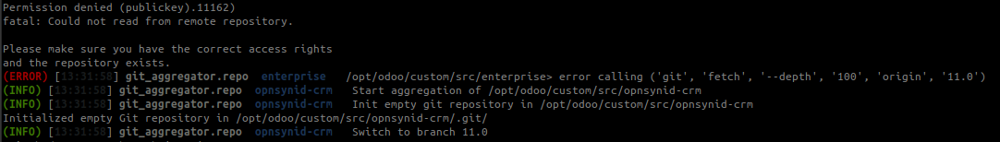
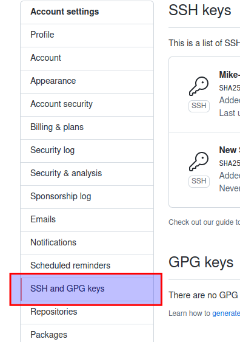
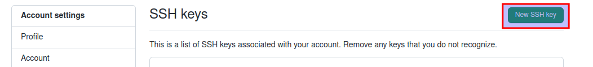
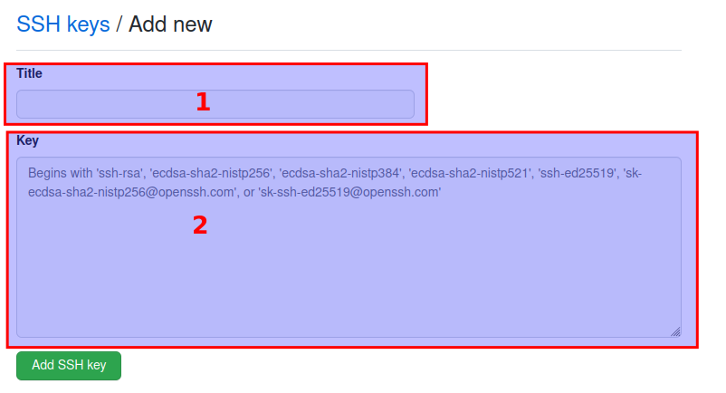

# Error pada git-aggregate

Error ini biasanya terjadi ketika menjalankan sintaks **invoke git-aggregate** pada docker-copier-template.<br/>Masalah ini muncul karena ada beberapa repository yang bersifat **private**, sehingga untuk meng-*clone* repo tersebut dibutuhkan SSH Keys



Langkah - langkah untuk menyelesaikan error:

#### 1. Membuat SSH Key
Sintaks:

```bash
ssh-keygen -t rsa -b 4096
```
> NOTE: Abaikan apabila SSH Key sudah pernah dibuat

#### 2. Copy SSH Key ke dalam docker-copier-template
Sintaks:
```bash
cat {lokasi-ssh-key}/id_rsa > {docker-copier-template}/odoo/custom/ssh/id_rsa
cat {lokasi-ssh-key}/id_rsa.pub > {docker-copier-template}/odoo/custom/ssh/id_rsa.pub
```
> NOTE: **{lokasi-ssh-key}** tergantung pada saat pembuatan SSH keys pada **Langkah - 1** (Default: {home}/.ssh/id_rsa)

#### 3. Daftarkan SSH Key pada github

* **3.1 Buka github [github.com](https://github.com) dan login.**

* **3.2. Klik icon profile pada kanan atas, dan klik menu **Settings**.**


* **3.3. Klik menu **SSH and GPG Keys**.**



* **3.4. Klik tombol **New SSH Key**.**



* **3.5. Isi Form**



    Penjelasan:
    1. Isi title sesuai kebutuhan
    2. Isi dengan id_rsa.pub yang sudah dibuat pada Langkah - 1

* **3.6. Klik Tombol **Add SSH key****

#### 4. Re-Build Docker Copier Template
Sintaks:

```bash
invoke img-build
```

#### 5. Jalankan git-aggregate
Sintaks:

```bash
invoke git-aggregate
```
