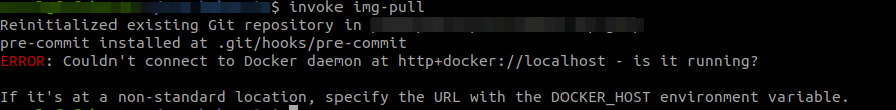
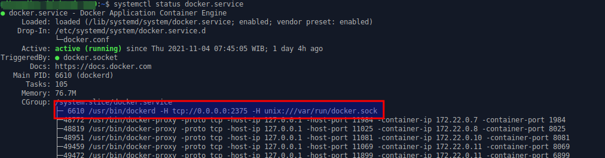
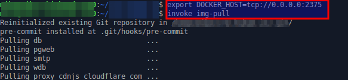

# Error pada saat invoke

Error ini biasanya terjadi pada saat akan menjalankan sintaks **invoke img-pull** pada docker-copier-template.



Langkah - langkah untuk menyelesaikan error:

#### 1. Edit file konfigurasi Docker
Sintaks:

```bash
sudo pico /etc/systemd/system/docker.service.d
```
Apabila folder **docker.service.d** dan file **docker.conf** tidak ada, silahkan buat folder dan file tersebut menggunakan sintaks:

```bash
sudo mkdir /etc/systemd/system/docker.service.d
```
```bash
sudo touch /etc/systemd/system/docker.service.d/docker.conf
```

#### 2. Isi file docker.conf
```bash
[Service]
ExecStart=
ExecStart=/usr/bin/dockerd -H tcp://0.0.0.0:2375 -H unix:///var/run/docker.sock
```

#### 3. Reload config
Sintaks:

```bash
systemctl daemon-reload
```

#### 4. Restart docker
Sintaks:

```bash
systemctl restart docker.service
```

#### 5. Check status docker service
Sintaks:

```bash
systemctl status docker.service
```

Pastikan docker sudah di bind **/usr/bin/dockerd -H tcp://0.0.0.0:2375 -H unix:///var/run/docker.sock**



#### 6. Menjalankan invoke img-pull dengan DOCKER_HOST

Sintaks:

```bash
cd {nama-folder-docker-copier-template}
export DOCKER_HOST=tcp://0.0.0.0:2375
invoke img-pull
```

